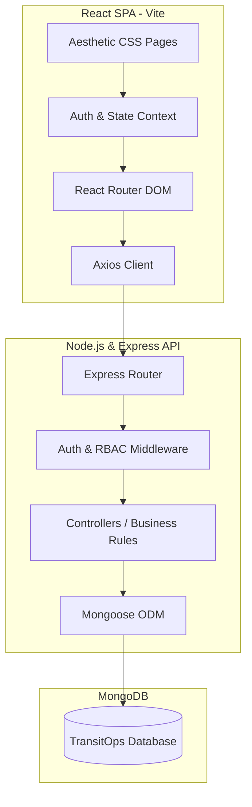
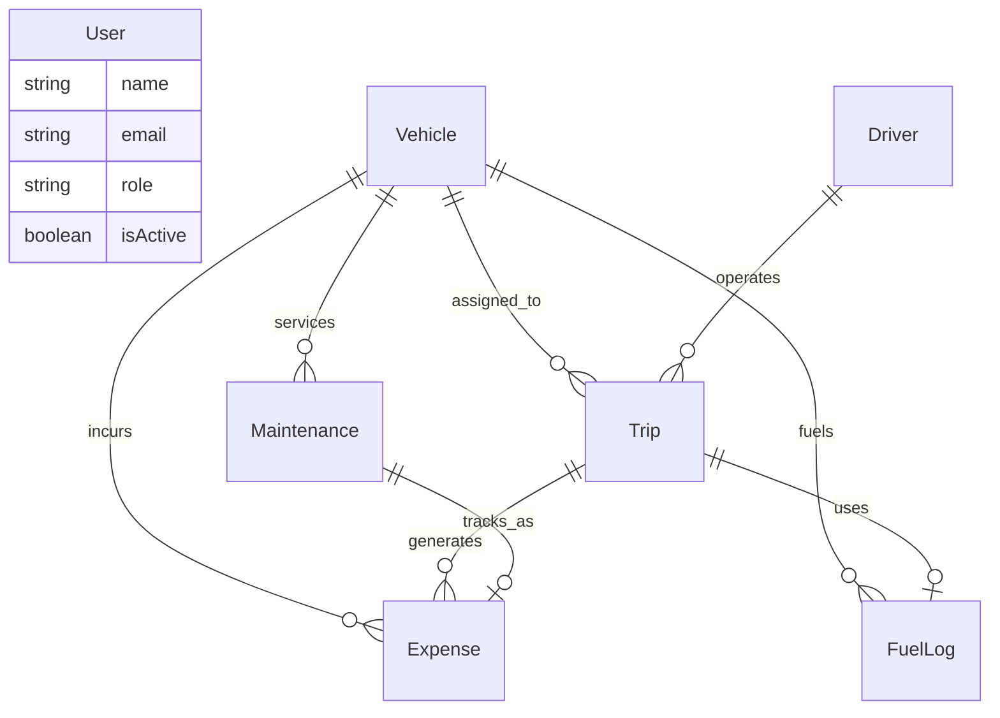

# TransitOps — Smart Transport Operations Platform
## Implementation & Architecture Plan (Phase 0)

TransitOps is a production-quality, role-based internal transport operations platform designed using the MERN stack (MongoDB, Express, React, Node.js). This document serves as the software architecture design and step-by-step development roadmap.

---

## Final System Architecture

The platform uses a monolithic-repository architecture split into:
1. **Frontend**: React SPA (using Vite) utilizing Vanilla CSS for precise dark-themed UI aesthetics, and standard Context API for lightweight state management.
2. **Backend**: Express.js server providing RESTful API endpoints, routing, controllers, models, and custom middlewares.
3. **Database**: MongoDB with Mongoose for structured modeling, indexing, and strict schema validation.
4. **Auth & Security**: JWT stored in HTTP-only cookies (or local storage as fallback), bcrypt password hashing, and role-based route protection on both backend and frontend.



---

## User Review Required

Please review the proposed design decisions below. Highlighted in the **Open Questions** section are crucial assumptions regarding trip revenue and licensing logic.

### Crucial Assumptions and Open Questions

1. **How is Trip Revenue calculated for ROI?**
   *Requirement*: The Analytics screen shows a formula: `ROI = (Revenue - (Maintenance + Fuel)) / Acquisition Cost`. However, the Trip Dispatcher form has no "revenue" input.
   *Proposed Solution*: We will calculate Trip Revenue dynamically as a function of the trip: `Revenue = Cargo Weight (kg) * RatePerKg + Planned Distance (km) * RatePerKm`, with the base rates configurable or hardcoded (e.g. ₹2/kg and ₹15/km). Additionally, we will allow the Dispatcher to manually adjust/override this revenue value when completing a trip.
   
2. **Concurrency of Drivers and Vehicles**:
   *Requirement*: A driver or vehicle "On Trip" cannot be dispatched.
   *Proposed Solution*: If a trip is marked as "Dispatched", both the Driver and Vehicle status change to "On Trip". If the trip is "Completed" or "Cancelled", their statuses revert to "Available" (unless the vehicle has gone to the maintenance shop, which sets it to "In Shop"). A driver cannot be assigned to any trip unless they are "Available" and their license is not expired.

---

## MongoDB Collection & Model Plan

### 1. User Model (`User`)
Stores internal staff credentials and system access levels.
*   `name`: `String` (Required)
*   `email`: `String` (Required, Unique, Lowercase, Indexed)
*   `password`: `String` (Required, Hashed)
*   `role`: `String` (Required, Enum: `['admin', 'fleet_manager', 'dispatcher', 'safety_officer', 'financial_analyst']`)
*   `isActive`: `Boolean` (Default: `true`)
*   `failedLoginAttempts`: `Number` (Default: `0`)
*   `lockUntil`: `Date` (Optional, Null when not locked)

### 2. Vehicle Model (`Vehicle`)
Manages fleet inventory and current state.
*   `registrationNumber`: `String` (Required, Unique, Uppercase, Indexed)
*   `nameModel`: `String` (Required, e.g. "VAN-05")
*   `type`: `String` (Required, Enum: `['Van', 'Truck', 'Mini']`)
*   `capacity`: `Number` (Required, weight capacity in kg)
*   `odometer`: `Number` (Required, current distance in km)
*   `acquisitionCost`: `Number` (Required, in INR)
*   `status`: `String` (Required, Enum: `['Available', 'On Trip', 'In Shop', 'Retired']`, Default: `'Available'`)

### 3. Driver Model (`Driver`)
Ensures driver compliance, performance tracking, and license validity.
*   `name`: `String` (Required)
*   `licenseNumber`: `String` (Required, Unique)
*   `licenseCategory`: `String` (Required, Enum: `['LMV', 'HMV']`)
*   `licenseExpiryDate`: `Date` (Required)
*   `contactNumber`: `String` (Required)
*   `tripCompletionRate`: `Number` (Default: `100`, percentage)
*   `safetyScore`: `Number` (Default: `10.0`, scale of 0 to 10)
*   `status`: `String` (Required, Enum: `['Available', 'On Trip', 'Suspended', 'Off Duty']`, Default: `'Available'`)

### 4. Trip Model (`Trip`)
Tracks transport operations, routes, cargo and assignments.
*   `tripCode`: `String` (Required, Unique, e.g., "TR001")
*   `source`: `String` (Required)
*   `destination`: `String` (Required)
*   `vehicle`: `Schema.Types.ObjectId` (Required, Ref: `Vehicle`)
*   `driver`: `Schema.Types.ObjectId` (Required, Ref: `Driver`)
*   `cargoWeight`: `Number` (Required, in kg)
*   `plannedDistance`: `Number` (Required, in km)
*   `actualDistance`: `Number` (Optional, updated on completion)
*   `status`: `String` (Required, Enum: `['Draft', 'Dispatched', 'Completed', 'Cancelled']`, Default: `'Draft'`)
*   `eta`: `String` (e.g. "45 min")
*   `revenue`: `Number` (Required, auto-calculated or overridden, in INR)
*   `dispatchedAt`: `Date`
*   `completedAt`: `Date`
*   `cancelledAt`: `Date`
*   `cancellationReason`: `String`

### 5. Maintenance Model (`Maintenance`)
Records vehicle service logs and cost tracking.
*   `vehicle`: `Schema.Types.ObjectId` (Required, Ref: `Vehicle`)
*   `serviceType`: `String` (Required, e.g. "Oil Change", "Engine Repair")
*   `cost`: `Number` (Required, in INR)
*   `date`: `Date` (Required)
*   `status`: `String` (Required, Enum: `['Active', 'Completed']`, Default: `'Active'`)
*   `notes`: `String`

### 6. FuelLog Model (`FuelLog`)
Tracks fuel ingestion costs.
*   `vehicle`: `Schema.Types.ObjectId` (Required, Ref: `Vehicle`)
*   `date`: `Date` (Required)
*   `liters`: `Number` (Required)
*   `fuelCost`: `Number` (Required, in INR)
*   `trip`: `Schema.Types.ObjectId` (Optional, Ref: `Trip` if logged as part of a trip)

### 7. Expense Model (`Expense`)
Aggregates miscellaneous operations cost items (toll, other, fuel, maintenance).
*   `trip`: `Schema.Types.ObjectId` (Optional, Ref: `Trip`)
*   `vehicle`: `Schema.Types.ObjectId` (Required, Ref: `Vehicle`)
*   `expenseType`: `String` (Required, Enum: `['Toll', 'Other', 'Maintenance', 'Fuel']`)
*   `amount`: `Number` (Required, in INR)
*   `date`: `Date` (Required)
*   `description`: `String`

### 8. SystemSettings Model (`SystemSettings`)
Maintains global application configurations (Single Document Collection).
*   `depotName`: `String` (Default: "Gandhinagar Depot GJ4")
*   `currency`: `String` (Default: "INR (Rs)")
*   `distanceUnit`: `String` (Default: "Kilometers")

---

## Entity Relationship Diagram



---

## REST API Plan

### 1. Authentication & User API (`/api/auth` & `/api/users`)
*   `POST /api/auth/login` - Authenticate user and generate JWT token
*   `POST /api/auth/logout` - Log out the authenticated user
*   `GET /api/users` - Retrieve all users
*   `GET /api/users/:id` - Retrieve a specific user
*   `POST /api/users` - Create a new user
*   `PUT /api/users/:id` - Update user information
*   `DELETE /api/users/:id` - Delete a user

### 2. Vehicle API (`/api/vehicles`)
*   `GET /api/vehicles` - Retrieve all vehicles
*   `GET /api/vehicles/:id` - Retrieve details of a specific vehicle
*   `POST /api/vehicles` - Register a new vehicle
*   `PUT /api/vehicles/:id` - Update vehicle information
*   `DELETE /api/vehicles/:id` - Delete a retired vehicle

### 3. Driver API (`/api/drivers`)
*   `GET /api/drivers` - Retrieve all drivers
*   `GET /api/drivers/:id` - Retrieve details of a specific driver
*   `POST /api/drivers` - Register a new driver
*   `PUT /api/drivers/:id` - Update driver information
*   `DELETE /api/drivers/:id` - Delete a driver record

### 4. Trip API (`/api/trips`)
*   `GET /api/trips` - Retrieve all trips
*   `GET /api/trips/:id` - Retrieve details of a specific trip
*   `POST /api/trips` - Create a new trip
*   `PUT /api/trips/:id` - Update trip information or status
*   `DELETE /api/trips/:id` - Delete or remove a trip
*   `PUT /api/trips/:id/dispatch` - Dispatch a trip
*   `PUT /api/trips/:id/complete` - Mark a trip as completed
*   `PUT /api/trips/:id/cancel` - Cancel a trip

### 5. Maintenance API (`/api/maintenance`)
*   `GET /api/maintenance` - Retrieve all maintenance records
*   `GET /api/maintenance/:id` - Retrieve a specific maintenance record
*   `POST /api/maintenance` - Create a new maintenance record
*   `PUT /api/maintenance/:id` - Update maintenance information
*   `DELETE /api/maintenance/:id` - Delete a maintenance record
*   `PUT /api/maintenance/:id/close` - Close a completed maintenance record
*   `GET /api/vehicles/:id/maintenance` - Retrieve maintenance history of a vehicle

### 6. Fuel Log API (`/api/fuel-logs`)
*   `GET /api/fuel-logs` - Retrieve all fuel records
*   `GET /api/fuel-logs/:id` - Retrieve a specific fuel record
*   `POST /api/fuel-logs` - Add a new fuel record
*   `PUT /api/fuel-logs/:id` - Update a fuel record
*   `DELETE /api/fuel-logs/:id` - Delete a fuel record

### 7. Expense API (`/api/expenses`)
*   `GET /api/expenses` - Retrieve all expense records
*   `GET /api/expenses/:id` - Retrieve a specific expense
*   `POST /api/expenses` - Record a new expense
*   `PUT /api/expenses/:id` - Update an expense record
*   `DELETE /api/expenses/:id` - Delete an expense record

### 8. Dashboard API (`/api/dashboard`)
*   `GET /api/dashboard` - Retrieve dashboard statistics
*   `GET /api/dashboard/vehicles` - Retrieve vehicle-related dashboard statistics
*   `GET /api/dashboard/trips` - Retrieve trip-related dashboard statistics
*   `GET /api/dashboard/drivers` - Retrieve driver-related dashboard statistics
*   `GET /api/dashboard/recent-activities` - Retrieve recent system activities

### 9. Reports and Analytics API (`/api/reports`)
*   `GET /api/reports` - Retrieve available reports
*   `GET /api/reports/fuel-efficiency` - Generate fuel efficiency report
*   `GET /api/reports/fleet-utilization` - Generate fleet utilization report
*   `GET /api/reports/vehicle-roi` - Calculate vehicle ROI
*   `GET /api/reports/vehicle-performance` - Generate vehicle performance report
*   `GET /api/reports/export/csv` - Export report in CSV format

### 10. Settings API (`/api/settings`)
*   `GET /api/settings` - Retrieve system configuration
*   `PUT /api/settings` - Update system configuration (Admin-only)


---

## Role-Based Access Control (RBAC) Matrix

| Route Module | Fleet Manager | Dispatcher | Safety Officer | Financial Analyst | Administrator |
| :--- | :--- | :--- | :--- | :--- | :--- |
| **Dashboard** | View | View | View | View | View |
| **Fleet (Vehicles)** | Read / Write | Read Only | No Access | Read Only | Read / Write |
| **Drivers** | Read / Write | No Access | Read / Write | No Access | Read / Write |
| **Trips** | No Access | Read / Write | Read Only | No Access | Read / Write |
| **Maintenance** | Read / Write | No Access | No Access | No Access | Read / Write |
| **Fuel & Expenses** | No Access | No Access | No Access | Read / Write | Read / Write |
| **Analytics & Reports** | Read Only | No Access | No Access | Read / Write | Read / Write |
| **Settings** | No Access | No Access | No Access | No Access | Read / Write |

---

## Business-Rule Matrix (Validation Logic)

| Trigger Event | Business Rule / Constraint | Database State Changes |
| :--- | :--- | :--- |
| **Vehicle Creation** | Registration number must be unique. | Vehicle saved. |
| **Trip Dispatch** | Vehicle must be `Available` (Cannot be `Retired` or `In Shop`). | Trip -> `Dispatched`<br>Vehicle -> `On Trip`<br>Driver -> `On Trip` |
| **Trip Dispatch** | Driver must be `Available` (Cannot be `Suspended` or `Off Duty`). | (Same as above) |
| **Trip Dispatch** | Driver's license must not be expired. | (Blocked if expired) |
| **Trip Dispatch** | Cargo weight must not exceed vehicle's max capacity. | (Blocked if weight > capacity) |
| **Trip Completion** | Updates odometer distance, logs actual route distance. | Trip -> `Completed`<br>Vehicle -> `Available`<br>Driver -> `Available`<br>Vehicle.odometer += actualDistance |
| **Trip Completion** | Associated tolls and fuel recorded trigger corresponding `Expense` creations. | Creates Expense logs and Fuel logs linked to the trip. |
| **Trip Cancellation** | Correctly reverts driver/vehicle statuses to Available. | Trip -> `Cancelled`<br>Vehicle -> `Available`<br>Driver -> `Available` |
| **Start Maintenance** | Moves vehicle to shop, removing it from selection pool. | Maintenance -> `Active`<br>Vehicle -> `In Shop` |
| **Close Maintenance** | Vehicle returned to service unless it was explicitly `Retired`. | Maintenance -> `Completed`<br>Vehicle -> `Available` (unless Retired) |

---

## Folder Structure

```
TransitOps/
├── backend/
│   ├── config/             # DB connection, Cloudinary, etc.
│   ├── controllers/        # Controllers containing business logic
│   ├── middleware/         # Auth, RBAC validation, error handler
│   ├── models/             # Mongoose schemas
│   ├── routes/             # Express routes split by module
│   ├── utils/              # Custom errors, helpers
│   ├── server.js           # Server startup script
│   └── package.json
├── frontend/
│   ├── public/             # Static assets
│   ├── src/
│   │   ├── components/     # Layout, Sidebar, Cards, Modal components
│   │   ├── context/        # Auth Context API
│   │   ├── pages/          # Pages (Dashboard, Fleet, Trips, etc.)
│   │   ├── services/       # Axios API integrations
│   │   ├── App.jsx         # Routes, Auth providers
│   │   ├── index.css       # Clean Dark Theme CSS styling
│   │   └── main.jsx
│   ├── package.json
│   └── vite.config.js
├── docs/                   # PDF references and screenshots
└── package.json            # Monorepo/Workspace tool configuration
```

---

## Verification Plan

### Automated Tests
- Postman collections will be used to verify authentication cookies, authorization middleware, invalid requests (e.g. overloading a cargo weight), and state transition rules.

### Manual Verification
- **Auth Lockout**: Verify that entering the wrong password 5 times locks the user and blocks subsequent attempts.
- **Trip Dispatch Validation**: Select a vehicle with 500kg capacity, enter 700kg cargo weight. Verify that the UI displays a warning banner and disables the "Dispatch" button.
- **Cross-Module Chain**: Create a maintenance record -> verify vehicle changes to "In Shop" and cannot be selected on Trip Dispatcher. Close maintenance -> verify vehicle becomes "Available". Dispatch trip -> verify vehicle and driver statuses change to "On Trip". Complete trip -> verify vehicle and driver status return to "Available", vehicle odometer incremented, fuel/expenses logged, and Dashboard charts update.

---

## Implementation Roadmap (Phase-by-Phase)

*   **Phase 1**: Project bootstrap, User authentication, account lock-out mechanism, and RBAC middleware.
*   **Phase 2**: Vehicle registry CRUD, validation, and status manager.
*   **Phase 3**: Driver registration, license expiry checking, safety score monitoring, and status manager.
*   **Phase 4**: Trip management, lifecycle state-machine (Draft -> Dispatched -> Completed/Cancelled), cargo capacity validations.
*   **Phase 5**: Maintenance scheduling, Service records, "In Shop" status locks.
*   **Phase 6**: Fuel ingestion log, tolls & miscellaneous expense entry, operational cost calculations.
*   **Phase 7**: Analytics aggregation queries, reports exports (CSV/PDF), dynamic charts using Chart.js.
*   **Phase 8**: System settings (currency, distance units) and RBAC view configuration page.
